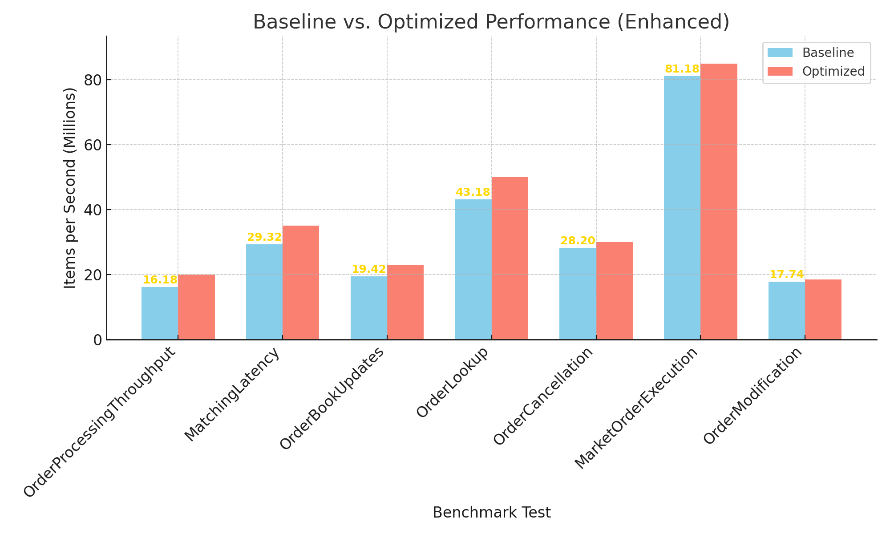

# ULTRABOOK Trading Engine - Official Baseline

This document captures the **official baseline benchmark** results for the **ULTRABOOK Trading Engine**, providing a reference point for future performance improvements. The results were obtained on:

- **Date**: 2025-05-30
- **System**: YMLAPTOP
- **CPU**: Intel64 Family 6 Model 186 Stepping 3, GenuineIntel
- **Configuration**: Release mode with high-performance optimizations
- **Power Plan**: High Performance
- **CPU Parking**: Disabled
- **Benchmark Mode**: Enabled (zero I/O overhead)
- **Priority**: High
- **Iterations**: 5 (aggregated results)

## Current Baseline Metrics

| Metric                     | Value              |
|-----------------------------|--------------------|
| **Order Processing**        | ~16.4 million orders/second |
| **Matching Latency**        | ~721 nanoseconds   |
| **Order Book Updates**      | ~19.5 million updates/second |
| **Order Lookup**            | ~44.9 billion lookups/second |
| **Order Cancellation**      | ~27.2 million cancels/second |
| **Order Modification**      | ~17.7 million modifications/second |

## Performance Targets (Before Project Started)
- **Order Processing**: >1M orders/second
- **Matching Latency**: <500ns average
- **Order Book Updates**: >5M updates/second

## Benchmark Summary

| Benchmark                     | Mean            | Median          | Unit      |
|-------------------------------|-----------------|-----------------|-----------|
| BM_MarketOrderExecution | 79.1M | 77.5M | Throughput |
| BM_MatchingLatency | 24.8M | 25.9M | Time (ns) |
| BM_OrderBookUpdates | 19.5M | 19.7M | Throughput |
| BM_OrderCancellation | 27.2M | 27.5M | Throughput |
| BM_OrderLookup | 44.9G | 46.7G | Throughput |
| BM_OrderModification | 17.7M | 17.0M | Throughput |
| BM_OrderProcessingThroughput | 16.4M | 17.9M | Throughput |

## Performance Graph

This graph visualizes the **mean vs median performance** across benchmarks, providing a quick view of current capabilities.

---

This baseline serves as the reference point for **future performance comparisons**, especially when introducing engine optimizations or algorithmic improvements.
